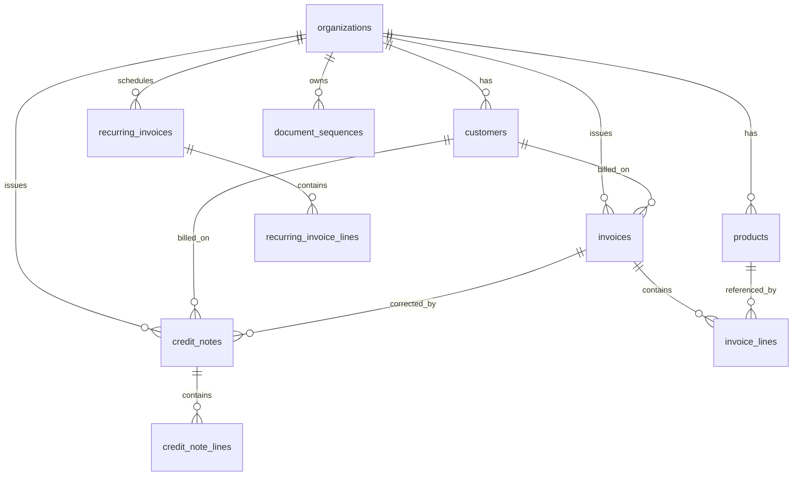

# Design: Invoicing Domain + JPA Migration + BaseEntity

> Status: **Draft for implementation.** Audience: AI coding agents and reviewers.
> Scope: introduce the core invoicing domain (Customers, Products/Services, Invoices,
> Credit Notes, Recurring Invoices), a VAT computation module, migrate persistence
> from `JdbcTemplate` to **Spring Data JPA**, and add a shared **`BaseEntity`**
> (created_at, updated_at, version).
>
> This document defines the target design and a phased task plan. Read
> [`AGENTS.md`](../AGENTS.md) first — its Database Rules and Coding Rules are binding
> and this design conforms to them. Where this document and `AGENTS.md` conflict,
> `AGENTS.md` wins; raise the conflict rather than diverging silently.

---

## 1. Goals & Non-Goals

### Goals
- Tenants can manage **Customers**, a **catalog** of Products/Services, and create
  **Invoices**, **Credit Notes**, and **Recurring Invoices**.
- A **VAT module** computes VAT on invoices/credit notes now, and is structured so
  **VAT return filing** can be added later without redesign.
- Replace `JdbcTemplate` repositories with **Spring Data JPA** across the codebase
  (existing `auth` persistence included).
- Introduce **`BaseEntity`** carrying `created_at`, `updated_at`, `version`
  (optimistic locking) via JPA auditing, used by all persistent entities.
- Preserve existing conventions: UUIDv7 ids, uppercase-`VARCHAR` enums from
  `common`, `timestamptz`, Flyway forward-only migrations, strict tenant isolation.

### Non-Goals (deferred, design must not block them)
- VAT **return filing** submission (only computation + rate model now).
- ASP / UAE federal e-invoicing platform integration (keep fields/extension points, no integration).
- Payments, banking, Stripe/subscription billing.
- Full ERP (inventory, purchasing, GL). The model should not paint us into a corner, but we do not build it now.
- Reporting/analytics beyond simple list/detail queries.

---

## 2. Key Architecture Decisions

Each decision below has a recommendation. Items marked **[CONFIRM]** should be
signed off by a human before the dependent task starts; proceed with the
recommended default if no objection.

### D1 — Persistence: Spring Data JPA (Hibernate) everywhere
Adopt `spring-boot-starter-data-jpa`. Remove `spring-boot-starter-jdbc` usage.
Entities are mutable classes (not records — JPA needs a no-arg constructor and
mutable fields). API request/response types stay as **records** (DTOs) in the
module that owns the endpoint; entities never leak past the service layer.

### D2 — Primary key generation: keep DB `DEFAULT uuidv7()`, read back via Hibernate
Do **not** generate ids in Java (no built-in RFC-4122 v7 in the JDK, and `AGENTS.md`
mandates DB `DEFAULT uuidv7()`). Map the id column so Hibernate lets the DB assign it
and reads the value back on insert:

```java
@Id
@GeneratedValue // DB-side; see note
@Column(name = "id", updatable = false, nullable = false)
@org.hibernate.annotations.Generated(event = org.hibernate.generator.EventType.INSERT)
@org.hibernate.annotations.ColumnDefault("uuidv7()")
private UUID id;
```
Use `INSERT ... RETURNING id` behavior (Hibernate does this for `@Generated` on
PostgreSQL). Verify in an integration test that `id` is populated after `save()`.
**[CONFIRM]** If the team prefers app-side ids later, we can switch to a UUIDv7
generator in `common`; not now.

### D3 — `BaseEntity` location: `common` module
Put `BaseEntity` in `common` (enums already live there and every entity references
them). This requires adding the JPA + Spring Data auditing APIs to `common` as
`api` dependencies. Rationale: lowest friction, single shared base.
**[CONFIRM]** Alternative is a dedicated `persistence` module to keep `common`
free of JPA. Recommendation: `common`, revisit only if `common` must stay
dependency-light.

### D4 — Auditing & timestamps: Spring Data JPA auditing (application code)
Use `@CreatedDate` / `@LastModifiedDate` with `AuditingEntityListener` and a single
`@EnableJpaAuditing` config. This satisfies `AGENTS.md` ("update timestamps in
application code, not DB triggers"). Keep the DB `DEFAULT now()` on `created_at`
as a backstop; JPA is the source of truth for `updated_at`.

### D5 — Optimistic locking: `@Version` on every table
Add a `version BIGINT NOT NULL DEFAULT 0` column to all tables (new and existing).
Existing tables (`users`, `organizations`, `organization_members`, `refresh_tokens`)
get the column via a **new** forward-only migration (never edit V1/V2).

### D6 — Enums: `EnumType.STRING`, values defined in `common`
All new enums live in `common/domain`, persisted as uppercase `VARCHAR`
(`@Enumerated(EnumType.STRING)`). No PostgreSQL enum types (per `AGENTS.md`).

### D7 — Money: `BigDecimal` over `NUMERIC`
- Monetary amounts (subtotals, VAT, totals): `NUMERIC(15, 2)` → `BigDecimal`.
- Unit prices and quantities: `NUMERIC(15, 4)` → `BigDecimal` (allow finer granularity).
- Currency stored as ISO 4217 `CHAR(3)`, default `AED`.
- Rounding: compute VAT **per line**, round HALF_UP to 2 decimals, then sum for
  invoice totals. **[CONFIRM]** line-level vs invoice-level rounding is an FTA
  policy choice; default line-level.

### D8 — Tenant isolation: explicit `organization_id` on every business row + query scoping
Every business table has `organization_id` (FK → `organizations`, indexed). Every
repository query is scoped by `organization_id` taken from `TenantContext`
(`auth` module), never from a raw request field. Services must pass the resolved
org id; do not rely on Hibernate global filters for MVP (explicit is safer and
auditable). Cross-tenant access = 404/403, never a silent leak.

### D9 — Module layout: feature modules own entity/repo/service; controllers stay in api modules
Follow the existing `auth` pattern. New modules:
- **`invoicing`** — customers, products/services, invoices, credit notes, recurring invoices (entities, repositories, services).
- **`vat`** — VAT rate model + calculation service (no persistence beyond rate config; return filing later).

Controllers remain in **`tenant-api`** (tenant CRUD) and **`admin-api`** (only if a
platform-admin view is needed later — none required for MVP). `invoicing` depends
on `vat` and `common`; both depend on `auth` only for `TenantContext`/current-user
if strictly needed (prefer passing ids in, to avoid coupling).
**[CONFIRM]** Single `invoicing` module vs splitting customers/products into a
`catalog` module. Recommendation: one `invoicing` module now; split later if it grows.

### D10 — Document numbering: per-organization sequences, transactional
Invoice numbers and credit-note numbers are per-organization, gap-tolerant,
monotonic sequences. Use a dedicated table row per (organization, document_type)
locked with `SELECT ... FOR UPDATE` inside the issuing transaction. Format is
configurable per org later; default `INV-{yyyy}-{000001}` / `CRN-{yyyy}-{000001}`.
Draft invoices get **no** number until issued.

---

## 3. Target Module & Dependency Graph

```
common (enums, DTOs, BaseEntity, JPA/auditing config)  ← now depends on jakarta.persistence-api
  ▲        ▲            ▲
  │        │            │
auth     vat        invoicing ──▶ vat
  ▲        ▲            ▲
  └────────┴──── tenant-api ──▶ auth, invoicing, vat
                 admin-api  ──▶ auth
app (bootJar, Flyway migrations, @EnableJpaAuditing wiring, Testcontainers)
```

Add to `settings.gradle`: `include 'invoicing'`, `include 'vat'`.

---

## 4. `BaseEntity`

`common/src/main/java/com/einvoicing/common/persistence/BaseEntity.java`:

```java
@MappedSuperclass
@EntityListeners(AuditingEntityListener.class)
public abstract class BaseEntity {

    @Id
    @Column(name = "id", updatable = false, nullable = false)
    @org.hibernate.annotations.Generated(event = EventType.INSERT)
    @org.hibernate.annotations.ColumnDefault("uuidv7()")
    private UUID id;

    @CreatedDate
    @Column(name = "created_at", updatable = false, nullable = false)
    private Instant createdAt;

    @LastModifiedDate
    @Column(name = "updated_at", nullable = false)
    private Instant updatedAt;

    @Version
    @Column(name = "version", nullable = false)
    private long version;

    // protected no-arg ctor, getters; equals/hashCode by id (null-safe until assigned)
}
```

Auditing config in `common` (or `app`), enabled once:
```java
@Configuration
@EnableJpaAuditing
public class JpaAuditingConfig { }
```

Notes:
- `equals`/`hashCode`: use id when non-null; follow the standard JPA-entity pattern
  (do not use Lombok unless the project already does — it does not).
- Every persistent entity `extends BaseEntity`; its table must have `id`,
  `created_at`, `updated_at`, `version` columns.

---

## 5. Domain Model

### 5.1 ER overview



### 5.2 New enums (`common/domain`)
- `ProductType { GOODS, SERVICE }`
- `ProductStatus { ACTIVE, ARCHIVED }`
- `CustomerStatus { ACTIVE, ARCHIVED }`
- `InvoiceType { STANDARD, SIMPLIFIED }`  *(UAE tax invoice vs simplified)*
- `InvoiceStatus { DRAFT, ISSUED, PARTIALLY_PAID, PAID, CANCELLED }`  *(payments later; keep PAID states)*
- `CreditNoteStatus { DRAFT, ISSUED, CANCELLED }`
- `RecurringStatus { ACTIVE, PAUSED, ENDED }`
- `RecurringFrequency { WEEKLY, MONTHLY, QUARTERLY, YEARLY }`
- `VatCategory { STANDARD, ZERO_RATED, EXEMPT, OUT_OF_SCOPE, REVERSE_CHARGE }`
- `DocumentType { INVOICE, CREDIT_NOTE }`  *(for numbering sequences)*

### 5.3 Entities & columns

Tables are plural, `snake_case`; all include the `BaseEntity` columns
(`id, created_at, updated_at, version`) — omitted from the lists below for brevity.
All FKs are indexed. All monetary/quantity types per **D7**.

**customers** (tenant-scoped)
| column | type | notes |
|---|---|---|
| organization_id | UUID NOT NULL FK→organizations | indexed |
| name | VARCHAR(255) NOT NULL | display/legal name |
| name_ar | VARCHAR(255) | Arabic name (optional) |
| trn | VARCHAR(15) | buyer TRN, nullable (unregistered buyers) |
| email | VARCHAR(320) | normalized in app |
| phone | VARCHAR(40) | |
| address_line1 | VARCHAR(255) | |
| address_line2 | VARCHAR(255) | |
| city | VARCHAR(100) | |
| emirate | VARCHAR(32) | `UaeEmirate` when country=AE |
| country_code | CHAR(2) NOT NULL DEFAULT 'AE' | |
| status | VARCHAR(32) NOT NULL DEFAULT 'ACTIVE' | `CustomerStatus` |
| Unique | (organization_id, trn) where trn not null | app-enforced or partial index |

**products** (catalog; goods & services, tenant-scoped)
| column | type | notes |
|---|---|---|
| organization_id | UUID NOT NULL FK | indexed |
| type | VARCHAR(32) NOT NULL | `ProductType` |
| name | VARCHAR(255) NOT NULL | |
| description | TEXT | |
| sku | VARCHAR(64) | optional code; unique per org when present |
| unit_of_measure | VARCHAR(32) | e.g. EACH, HOUR, KG |
| unit_price | NUMERIC(15,4) NOT NULL | default sell price |
| currency | CHAR(3) NOT NULL DEFAULT 'AED' | |
| vat_category | VARCHAR(32) NOT NULL DEFAULT 'STANDARD' | `VatCategory` |
| status | VARCHAR(32) NOT NULL DEFAULT 'ACTIVE' | `ProductStatus` |

**invoices** (tenant-scoped)
| column | type | notes |
|---|---|---|
| organization_id | UUID NOT NULL FK | indexed |
| customer_id | UUID NOT NULL FK→customers | indexed |
| invoice_number | VARCHAR(64) | NULL until issued; unique per org |
| type | VARCHAR(32) NOT NULL DEFAULT 'STANDARD' | `InvoiceType` |
| status | VARCHAR(32) NOT NULL DEFAULT 'DRAFT' | `InvoiceStatus` |
| issue_date | DATE | set on issue |
| due_date | DATE | |
| currency | CHAR(3) NOT NULL DEFAULT 'AED' | |
| subtotal | NUMERIC(15,2) NOT NULL DEFAULT 0 | sum of line subtotals (ex-VAT) |
| vat_total | NUMERIC(15,2) NOT NULL DEFAULT 0 | |
| total | NUMERIC(15,2) NOT NULL DEFAULT 0 | subtotal + vat_total |
| notes | TEXT | |
| terms | TEXT | |
| created_by_user_id | UUID FK→users ON DELETE SET NULL | audit |
| recurring_invoice_id | UUID FK→recurring_invoices | set when auto-generated |
| Unique | (organization_id, invoice_number) | partial (number not null) |

**invoice_lines**
| column | type | notes |
|---|---|---|
| invoice_id | UUID NOT NULL FK→invoices ON DELETE CASCADE | indexed |
| product_id | UUID FK→products ON DELETE SET NULL | nullable (free-text line) |
| line_number | INT NOT NULL | ordering |
| description | VARCHAR(500) NOT NULL | snapshot of product name/desc |
| quantity | NUMERIC(15,4) NOT NULL | |
| unit_price | NUMERIC(15,4) NOT NULL | snapshot at line time |
| vat_category | VARCHAR(32) NOT NULL | snapshot |
| vat_rate | NUMERIC(6,4) NOT NULL | e.g. 0.0500 = 5%; snapshot |
| line_subtotal | NUMERIC(15,2) NOT NULL | quantity × unit_price (ex-VAT) |
| vat_amount | NUMERIC(15,2) NOT NULL | rounded per D7 |
| line_total | NUMERIC(15,2) NOT NULL | line_subtotal + vat_amount |

> **Snapshotting:** invoice/credit-note lines copy price, description, vat_category
> and vat_rate at creation time. Editing a product later must not mutate issued
> documents.

**credit_notes** — same shape as `invoices` plus:
| column | type | notes |
|---|---|---|
| invoice_id | UUID FK→invoices | original invoice being corrected (nullable for standalone) |
| credit_note_number | VARCHAR(64) | NULL until issued; unique per org |
| status | VARCHAR(32) NOT NULL DEFAULT 'DRAFT' | `CreditNoteStatus` |
| reason | VARCHAR(500) | |

**credit_note_lines** — same shape as `invoice_lines` (FK → credit_notes).

**recurring_invoices** (template + schedule, tenant-scoped)
| column | type | notes |
|---|---|---|
| organization_id | UUID NOT NULL FK | indexed |
| customer_id | UUID NOT NULL FK | indexed |
| status | VARCHAR(32) NOT NULL DEFAULT 'ACTIVE' | `RecurringStatus` |
| frequency | VARCHAR(32) NOT NULL | `RecurringFrequency` |
| interval_count | INT NOT NULL DEFAULT 1 | e.g. every 2 months |
| start_date | DATE NOT NULL | |
| end_date | DATE | null = open-ended |
| next_run_date | DATE NOT NULL | indexed for the scheduler |
| currency | CHAR(3) NOT NULL DEFAULT 'AED' | |
| notes / terms | TEXT | template defaults |

**recurring_invoice_lines** — same shape as `invoice_lines` (FK → recurring_invoices),
minus computed line totals (recompute on generation).

**document_sequences** (numbering, per D10)
| column | type | notes |
|---|---|---|
| organization_id | UUID NOT NULL FK | |
| document_type | VARCHAR(32) NOT NULL | `DocumentType` |
| next_value | BIGINT NOT NULL DEFAULT 1 | |
| Unique | (organization_id, document_type) | |

---

## 6. VAT Module (`vat`)

- `VatCategory` enum (in `common`) with the UAE set (STANDARD 5%, ZERO_RATED,
  EXEMPT, OUT_OF_SCOPE, REVERSE_CHARGE).
- `VatRate` model mapping category → rate, effective-dated so historical rates
  survive rate changes. MVP: a small config/table `vat_rates(category, rate,
  effective_from, effective_to)`; seed STANDARD=0.05, ZERO_RATED=0, EXEMPT=0.
  **[CONFIRM]** table-driven vs constant map. Recommendation: table (future-proofs rate changes & filing).
- `VatCalculator` service (pure, no DB): given lines (quantity, unit_price,
  category, resolved rate) returns per-line `line_subtotal`, `vat_amount`,
  `line_total`, and document `subtotal`/`vat_total`/`total`. Rounding per **D7**.
  Deterministic and unit-tested against FTA examples.
- **Future (non-goal now):** `vat_returns` table + period aggregation + ASP
  submission. Design `VatCalculator` and rate model so a return job can aggregate
  issued invoices/credit notes by period and category without schema changes.

---

## 7. JPA Migration Plan (existing `auth` persistence)

Convert the three JdbcTemplate repositories to JPA. This is a behavior-preserving
refactor — tests must still pass.

1. Introduce entities extending `BaseEntity`:
   - `UserEntity` (`users`), `OrganizationEntity` (`organizations`),
     `OrganizationMemberEntity` (`organization_members`), `RefreshTokenEntity`
     (`refresh_tokens`).
2. Replace `AuthUserRepository`, `AuthMembershipRepository`,
   `RefreshTokenRepository` with Spring Data `JpaRepository` interfaces + derived
   queries / `@Query` for the existing SQL (e.g. `hasActiveMembership`,
   `findByTokenHash`, `updateLastLoginAt` → `@Modifying @Query`).
3. Update `AuthService`, `RefreshTokenService`, filters to use entities/DTOs. Keep
   API response records (`AuthMeResponse`, etc.) unchanged.
4. `updated_at` now driven by JPA auditing; drop manual `updated_at = now()` from
   the migrated SQL paths.
5. Add `version` handling — see migration in §8.
6. Swap module deps: `auth/build.gradle` replace `spring-boot-starter-jdbc` with
   `spring-boot-starter-data-jpa`; ensure PostgreSQL driver at runtime in `app`,
   H2 for tests (already present).

> Keep the existing `JwtTokenService` constant-time and issuer/expiry checks
> untouched — this migration is persistence-only.

---

## 8. Migrations (Flyway, forward-only)

Never edit V1/V2. New migrations:

- **`V3__add_version_to_identity_tables.sql`** — add `version BIGINT NOT NULL
  DEFAULT 0` to `users`, `organizations`, `organization_members`, `refresh_tokens`.
- **`V4__create_customers.sql`**
- **`V5__create_products.sql`**
- **`V6__create_document_sequences.sql`**
- **`V7__create_invoices_and_lines.sql`**
- **`V8__create_credit_notes_and_lines.sql`**
- **`V9__create_recurring_invoices_and_lines.sql`**
- **`V10__create_vat_rates.sql`** (+ seed rows for AED/UAE)

Rules (from `AGENTS.md`): `uuidv7()` PK default, `timestamptz`, uppercase VARCHAR
enums, no PG enum types, no CHECK constraints, no triggers, index every FK and the
recurring `next_run_date`. Add `version` column on every new table.

---

## 9. API Surface (tenant-api) — sketch

Thin controllers, `@Valid` DTOs, tenant scoping via authenticated context. All under
`/api/...` (tenant area). Auth already enforces area; each handler resolves
`organization_id` from `TenantContext` and passes it to services.

- Customers: `POST /api/customers`, `GET /api/customers`, `GET/PUT /api/customers/{id}`, `POST /api/customers/{id}/archive`
- Products: `POST /api/products`, `GET /api/products`, `GET/PUT /api/products/{id}`, archive
- Invoices: `POST /api/invoices` (draft), `PUT /api/invoices/{id}` (draft only),
  `POST /api/invoices/{id}/issue` (assigns number, computes VAT, locks),
  `POST /api/invoices/{id}/cancel`, `GET /api/invoices`, `GET /api/invoices/{id}`
- Credit notes: mirror invoices (`/api/credit-notes...`), optional link to an invoice
- Recurring: `POST /api/recurring-invoices`, list/get/update, `pause`/`resume`/`end`

Response/request bodies are records in `tenant-api` (or `common` if shared). Money
serialized as decimal strings to avoid float issues.

---

## 10. Recurring generation

A `@Scheduled` job (daily) in `invoicing` selects `recurring_invoices` where
`status = ACTIVE AND next_run_date <= today`, generates a **draft** invoice from the
template (recomputing VAT and snapshotting current product prices per policy),
advances `next_run_date` by `frequency × interval_count`, and sets `status = ENDED`
when past `end_date`. Idempotent per (recurring_invoice, period) — guard against
double-generation on restart. **[CONFIRM]** generate as DRAFT (recommended) vs
auto-ISSUE.

---

## 11. Testing Strategy

Per `AGENTS.md` test patterns:
- **VatCalculator**: pure unit tests, FTA worked examples, rounding edge cases.
- **Services**: `@ExtendWith(MockitoExtension.class)`, mocked repositories —
  invoice issue flow, numbering, status transitions, tenant-scope enforcement.
- **Repositories / tenant isolation**: `@DataJpaTest` + Testcontainers PostgreSQL
  (`TestContainersConfig` in `app`). Verify `uuidv7()` id population, `version`
  increment on update, auditing timestamps, and that cross-org queries return nothing.
- **Controllers**: `@WebMvcTest` + `@MockitoBean`.
- **Migration-backed**: full-context integration test in `app` confirming Flyway
  V3–V10 apply cleanly on an empty PostgreSQL.
- Keep/extend the auth security tests after the JPA migration (behavior unchanged).

---

## 12. Cross-cutting rules (do not violate)

- **Tenant isolation is a security boundary.** Every business query filters by
  `organization_id` from the authenticated context. No org id from a raw request
  body/param is trusted (`AGENTS.md` §Auth And Tenant Rules).
- **Issued documents are immutable** except status transitions; edits allowed only
  in `DRAFT`.
- **Snapshot** prices/descriptions/vat onto lines at creation.
- **Money** never uses `double`/`float`; always `BigDecimal` + `NUMERIC`.
- Forward-only migrations; enums in `common`; constructor injection; thin controllers.

---

## 13. Phased Task Plan

Work top-to-bottom; each phase should compile and pass tests before the next.
Tick boxes and note the migration versions / classes added.

### Phase 0 — Foundation
- [ ] P0.1 Add `spring-boot-starter-data-jpa` to `common`/`auth` (+ new modules); add JPA/auditing API deps to `common`. Keep H2 test runtime, PostgreSQL runtime in `app`.
- [ ] P0.2 Implement `BaseEntity` (§4) and `JpaAuditingConfig` (`@EnableJpaAuditing`) in `common`; wire in `app`.
- [ ] P0.3 `V3__add_version_to_identity_tables.sql` (add `version` to the 4 existing tables).
- [ ] P0.4 Prove the id/`@Generated` + auditing + `@Version` round-trip with one `@DataJpaTest` (Testcontainers).

### Phase 1 — Migrate auth to JPA
- [ ] P1.1 Add `UserEntity`, `OrganizationEntity`, `OrganizationMemberEntity`, `RefreshTokenEntity` (extend `BaseEntity`).
- [ ] P1.2 Replace the 3 JdbcTemplate repos with `JpaRepository` interfaces (+ `@Query` for `hasActiveMembership`, `findByTokenHash`, last-login update).
- [ ] P1.3 Update `AuthService`/`RefreshTokenService`/filters; remove `spring-boot-starter-jdbc`; drop manual `updated_at` writes.
- [ ] P1.4 All existing auth tests green; add repository tests for membership/refresh queries.

### Phase 2 — Customers & Products (`invoicing` module + catalog)
- [ ] P2.1 Create `invoicing` module; add to `settings.gradle`; deps on `common` (+`vat` later).
- [ ] P2.2 Enums in `common`: `CustomerStatus`, `ProductType`, `ProductStatus`, `VatCategory`.
- [ ] P2.3 `V4__create_customers.sql`, `V5__create_products.sql`.
- [ ] P2.4 Entities + repositories + services (tenant-scoped) for customers & products.
- [ ] P2.5 `tenant-api` controllers + DTOs + validation; service/controller/repo tests.

### Phase 3 — VAT module
- [ ] P3.1 Create `vat` module; `VatCategory` (if not already), `VatRate` model.
- [ ] P3.2 `V10__create_vat_rates.sql` + seed UAE rates. (Renumber if ordering matters — keep V-numbers monotonic at merge time.)
- [ ] P3.3 `VatCalculator` service (pure) + unit tests (FTA examples, rounding).

### Phase 4 — Invoices
- [ ] P4.1 Enums: `InvoiceType`, `InvoiceStatus`, `DocumentType`.
- [ ] P4.2 `V6__create_document_sequences.sql`, `V7__create_invoices_and_lines.sql`.
- [ ] P4.3 Entities (`Invoice`, `InvoiceLine`), repositories, numbering service (`SELECT … FOR UPDATE`).
- [ ] P4.4 `InvoiceService`: create/edit draft, issue (number + VAT compute + snapshot), cancel; status-transition guards; tenant scope.
- [ ] P4.5 Controllers + DTOs; full test set incl. tenant-isolation repo tests.

### Phase 5 — Credit Notes
- [ ] P5.1 Enum `CreditNoteStatus`; `V8__create_credit_notes_and_lines.sql`.
- [ ] P5.2 Entities/repos/service (optionally linked to an invoice); numbering via `document_sequences`.
- [ ] P5.3 Controllers + DTOs + tests.

### Phase 6 — Recurring Invoices
- [ ] P6.1 Enums `RecurringStatus`, `RecurringFrequency`; `V9__create_recurring_invoices_and_lines.sql`.
- [ ] P6.2 Entities/repos/service; `@Scheduled` generator (idempotent, DRAFT output).
- [ ] P6.3 Controllers (create/list/get/update, pause/resume/end) + tests incl. scheduler unit test.

### Phase 7 — Hardening
- [ ] P7.1 End-to-end integration test in `app`: onboard org → customer → product → invoice issue → credit note.
- [ ] P7.2 Confirm all FKs indexed, `next_run_date` indexed; review query plans for list endpoints.
- [ ] P7.3 Update `AGENTS.md` domain notes if any rule was clarified during build.

---

## 14. Open decisions to confirm with a human
Consolidated **[CONFIRM]** list: D2 (id strategy), D3 (`BaseEntity` in `common` vs
new module), D7 (rounding policy, money precision), D9 (single `invoicing` vs split
`catalog`), VAT rate table vs constants, recurring output DRAFT vs auto-ISSUE.
Proceed with the recommended default for each unless a reviewer objects.
